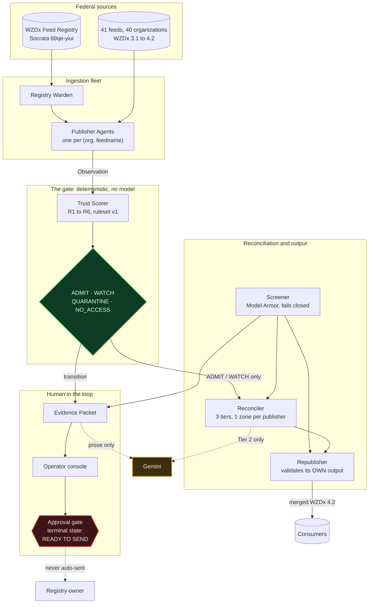

# Interchange

[](https://github.com/sneg55/interchange/actions/workflows/tests.yml)
[](https://www.python.org/downloads/)
[](https://www.transportation.gov/av/data/wzdx)
[](#reproduce-it)
[](LICENSE)

A governed ingestion fleet over the 40 organizations that publish federal WZDx work zone
feeds. It runs one agent per publisher, gates them on a deterministic trust score,
reconciles zones that several publishers describe, screens their free text before it reaches
anything, and writes one evidence packet that serves the data consumer and the registry
owner alike.

The registry lists 41 publisher feeds across those 40 organizations, because a publisher is
keyed on organization and feed name, and Colorado DOT publishes two.

## The problem, in one example

Utah DOT's work zone feed passes the official USDOT validator with zero errors. It also
asserts 744 work zones active, every one of them with an end date already in the past, on a
feed whose `update_date` has not moved in over three years.

Conformance is not trustworthiness, and nothing in the federal pipeline tells them apart.
Interchange does, deterministically, and shows its working.

```
$ python3 scripts/run_cycle.py
...
"states": { "Utah DOT|udot": "QUARANTINE", "Hawaii DOT|hidot": "QUARANTINE", ... }
"packets_opened": 2
"canonical_zones": 7808, "source_zones": 8199
"published": true, "validation": { "schema_version": "4.2", "error_count": 0 }
```

## See it live

The operator console is running at
**https://interchange-console-xl55uzo43q-uc.a.run.app**.

Sign in with any Google account. Every account gets read-only viewer access; the
Firestore security rules deny writes to all clients, so there is nothing a visitor can
break. The one write in the product, approving a notice, is restricted to an allowlist
checked server-side against the verified ID token, which is why the demo video shows the
approval instead of inviting you to make one: approvals land in the live audit trail, and
the audit trail is the product.

A tour that hits the argument in order:

1. The fleet board. Trust states across the fleet, with the key-gated feeds shown as
   `NO ACCESS` rather than counted as passing.
2. **Utah DOT / udot**, from the board. Two rules firing: a timestamp three years stale
   against a declared 15-minute cadence, and 744 active zones every one of which has
   already ended. The observation log below shows the same verdict on every poll.
3. The notice queue, then the Utah packet. The approve button stays disabled until the
   registry notice tab has been opened, because approval records a hash of the exact text
   the approver read.
4. Output health. The merged feed validated against the official WZDx 4.2 schema before
   publication, with every exclusion named and the arithmetic closing.
5. `/glossary`. Six rules, and four distinct words for absence, none of which is a pass.

When scheduled polling is suspended, the masthead carries a standing notice saying so and
dating the data; everything on screen is the real collected history either way.

## Reproduce it

Everything here runs offline, with no cloud account and no credentials, against a
checksummed snapshot of the live feeds in `tests/fixtures/`.

```bash
python3 -m pip install jsonschema   # the only dependency the offline path needs

python3 scripts/capture_fixtures.py --verify   # re-hash the snapshot
python3 scripts/run_cycle.py                   # one full fleet cycle
python3 -m unittest discover -s tests          # 473 tests
```

The suite is CPU-bound rather than slow on the network, and one module accounts for almost
all of it: `test_pipeline` takes about 1,824s, `test_fleet_end_to_end` 161s, and every other
module finishes in under 5s. CI runs `test_pipeline` as its own job for that reason.

The console:

```bash
cd console && npm install && npm run build && npm test
```

## Run it against the live fleet

This is the one entrypoint that reaches the internet: the federal registry first, then every
active publisher's feed. Everything above this line stays offline.

```bash
python3 scripts/run_live_cycle.py --once                    # one cycle, into ./.fleet
python3 scripts/run_live_cycle.py --interval 900            # on a cadence, until stopped
python3 scripts/run_live_cycle.py --store firestore --project "$GOOGLE_CLOUD_PROJECT"
```

State survives the process. Publisher records keep what the gate decided, retained
observations keep the window the streak and churn rules read, and the canonical source map
keeps IDs stable, so a restart resumes the fleet instead of starting a new one.

## What it does

| Component | What it decides |
|---|---|
| Registry Warden | Which publishers exist, keyed on `(organization, feedname)` |
| Publisher Agent | Reachability, freshness, conformance, contradiction, churn |
| Trust Scorer | `ADMIT` / `WATCH` / `QUARANTINE`, on six versioned rules |
| Screener | Whether publisher free text may cross an egress |
| Reconciler | Which zones from different publishers are the same zone |
| Evidence Packet | What a finding asserts, and who approved saying so |
| Republisher | What enters the merged feed, and whether to publish at all |
| Console | The only surface a human sees, and the approval gate |

## Architecture



Gemini hangs off the side of the diagram on dotted lines with no edge into the gate. The poll sequence, the two content hashes, where state lives and what is
wired against what is still a port are in `docs/architecture.md`.

## Three design decisions worth arguing with

### The model is never in the gate path

Gemini has exactly two places it may appear: adjudicating ambiguous duplicate pairs, and
drafting notice prose. Both are injected ports, and the offline cycle supplies neither, so an
ambiguous pair is counted `NOT_RUN` rather than merged and the notice ships as its
deterministic rendering. Absent a decision the safe direction is a split, because a wrong
merge hides a real closure while a wrong split only double counts. No confidence score is
requested from a model either. A scalar invites a threshold, and a threshold puts the model
back in the gate.

### Absence is never a pass

A rule that cannot be evaluated returns `NOT_APPLICABLE`, and the reason is recorded:
`MEASURED_INAPPLICABLE` counts toward a publisher's recovery while `MISSING_INPUT` does not.
An unresolvable schema version records `SCHEMA_UNKNOWN` and suppresses the rule instead of
failing the publisher. A key-gated publisher is `NO_ACCESS`, excluded from every coverage
denominator rather than counted as passing. Any cap or truncation is stated in the output.

### Interchange passes its own gate

The republisher validates its output against the official WZDx 4.2 schema before emitting,
and refuses to publish if it fails. A merged feed that would quarantine its own publisher is
the one failure this project cannot ship. The refusal is recorded as an artifact with
`published: false`, so it is evidence rather than an absence.

## The negative controls

A matcher that accepts everything looks impressive on the flagship pair and is worthless.
Two controls run as tests against real data.

Missouri DOT against St. Charles County: four candidate pairs fall inside the distance
threshold and three of them intersect at zero metres, for zones that are plainly different
work zones. One is a 4.8 km ramp closure lying inside a 33 km pavement corridor. Symmetric
length coverage scores them 0.039 to 0.075 against a 0.6 threshold and rejects all four.
Minimum distance alone would have merged them.

CivicLink against Missouri DOT: overlapping bounding boxes, zero candidate pairs.

## Layout

```
docs/architecture.md            the diagram and the data path
src/features/                   one directory per component
src/services/                   ports: registry, feed, screener, store, schema registry
src/entrypoints/fleet_cycle.py  the orchestration
console/                        Next.js operator console
scripts/                        research probes and the reproduction CLIs
tests/                          473 tests, offline
tests/fixtures/                 checksummed snapshot of the live feeds
infra/                          Firestore security rules and composite indexes
```

## Prior work

`scripts/` predates the build and is disclosed as prior-art tooling. Its probes reproduce the
research figures. They read public federal data, they take no credentials, and they write
nothing.

```bash
python3 scripts/wzdx_feed_health.py --validate-stale --text-surface
python3 scripts/wzdx_dedup_probe.py --a "Missouri DOT" --b "St. Charles County"
python3 scripts/test_wzdx.py          # offline, stdlib only
```

## Claims and their commands

Every quantity in this README has a command that prints it. Three review rounds turned up
figures that had been measured in throwaway scripts and written up as though the committed
probes produced them, so the rule now is: if you measure something, commit the code that
measures it, or do not write the number down.

| Claim | Command |
|---|---|
| Utah is conformant and contradictory | `python3 scripts/run_cycle.py` |
| Conditional GET is worth 8.2% of sweep bytes | `python3 scripts/probe_validators.py --live` |
| The snapshot is unmodified | `python3 scripts/capture_fixtures.py --verify` |
| Agent Engine deploy time and round trip | `python3 scripts/deploy_agents.py --deploy 1` then `--poll` |

Figures move. The registry and the feeds change underneath you. NJIT coverage ranged 87.3 to
100.0 percent across five runs in two days, and New York DOT carried 6,848 features when the
research was written and 6,299 when the reconciler was re-measured. No test asserts an exact
live count. They assert shape and direction instead.
