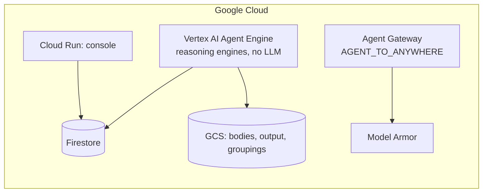

# Architecture

The diagram below is the data path through the fleet, from the federal registry to the
merged feed and the operator console.

## The fleet

```mermaid
flowchart TB
  subgraph Federal["Federal sources"]
    REG[("WZDx Feed Registry<br/>Socrata 69qe-yiui")]
    FEEDS[("40 publisher feeds<br/>WZDx 3.1 to 4.2")]
  end

  subgraph Fleet["Ingestion fleet"]
    WARDEN["Registry Warden<br/><i>6.1</i>"]
    AGENTS["Publisher Agents<br/>one per (org, feedname)<br/><i>6.2, 6.3</i>"]
  end

  subgraph Gate["The gate: deterministic, no model"]
    SCORER["Trust Scorer<br/>R1 to R6, ruleset v1<br/><i>6.4</i>"]
    STATE{"ADMIT · WATCH<br/>QUARANTINE · NO_ACCESS"}
  end

  subgraph Merge["Reconciliation and output"]
    SCREEN["Screener<br/>Model Armor, fails closed<br/><i>6.5</i>"]
    RECON["Reconciler<br/>3 tiers, 1 zone per publisher<br/><i>6.6</i>"]
    PUB["Republisher<br/>validates its OWN output<br/><i>6.8</i>"]
  end

  subgraph Human["Human in the loop"]
    PACKET["Evidence Packet<br/><i>6.7</i>"]
    CONSOLE["Operator console<br/><i>6.9</i>"]
    APPROVE{{"Approval gate<br/>terminal state:<br/>READY TO SEND"}}
  end

  GEM["Gemini"]

  REG --> WARDEN --> AGENTS
  FEEDS --> AGENTS
  AGENTS -->|Observation| SCORER --> STATE
  STATE -->|"ADMIT / WATCH only"| RECON
  STATE -->|transition| PACKET
  SCREEN --> RECON
  SCREEN --> PUB
  SCREEN --> PACKET
  RECON --> PUB
  PUB -->|"merged WZDx 4.2"| OUT[("Consumers")]
  PACKET --> CONSOLE --> APPROVE
  APPROVE -.->|"never auto-sent"| REGOWNER["Registry owner"]

  RECON -.->|"Tier 2 only"| GEM
  PACKET -.->|"prose only"| GEM

  style STATE fill:#1a3a2a,stroke:#2ea043
  style GEM fill:#3a2a1a,stroke:#d29922
  style APPROVE fill:#3a1a1a,stroke:#da3633
```



**Read the two dotted lines first.** They are the only paths a model touches, and both are
downstream of the gate. Gemini adjudicates ambiguous duplicate pairs and drafts notice prose.
It cannot reach `STATE`, and no code path may make it: a scalar confidence from a model
invites a threshold, and a threshold is a gate.

**Everything crossing into a model or into the output passes the screener first**, which
fails closed. If Model Armor is unavailable, text is redacted and flagged exactly as if it
had been blocked. Structural ingestion continues, because an Interchange-side outage must
not corrupt a publisher's trust history.

Screening therefore runs on **source** zones, before reconciliation, not on the merged
output afterwards. Tier 2 adjudication happens inside reconciliation and hands both records
to a model, so screening the output would redact what reaches the feed while the model had
already read the original. A canonical zone inherits a block from any of its sources, or a
merge could launder one.

## One poll

```mermaid
sequenceDiagram
  participant A as Publisher Agent
  participant P as Publisher feed
  participant S as Trust Scorer
  participant R as Records

  A->>P: GET (If-None-Match / If-Modified-Since)
  alt 304 Not Modified
    P-->>A: 304
    Note over A: body-derived fields copied from the last<br/>observation carrying them; age RECOMPUTED
  else 200
    P-->>A: body
    Note over A: content_hash + structural_hash,<br/>active / past-end counts, schema errors
  else failure
    P-->>A: timeout or non-2xx
    Note over A: recorded as an observation.<br/>Going dark is a signal, not a gap.
  end
  A->>R: Observation (append-only)
  A->>S: Observation + history
  S->>S: R1..R6, each with a verdict AND a reason
  S->>R: RuleEvaluation
  opt state changed
    S->>R: TrustTransition + EvidencePacket
  end
```

**The 304 path is where this design earns its keep.** A `304` is a successful poll, so it
must not feed R1. Its carried values are copies, not measurements, so they must not satisfy
a body-dependent rule. And conditional GET is suspended while such a rule is latching a
publisher, or a genuinely-unchanged feed answers `304` forever and can never accumulate a
clean poll no matter how well it behaves.

## The two hashes

| Hash | Covers | Read by |
|---|---|---|
| `content_hash` | id, geometry, dates, `event_status`, **`description`, `road_names`** | body snapshots, adaptive backoff |
| `structural_hash` | the same **minus the free text** | R5, frozen content |

R5 reads the structural hash because `description` is publisher-controlled text that Model
Armor may block. A publisher could otherwise hold its road zones frozen while rotating
injected descriptions, and every rotation would move the content hash, clear the
frozen-content signal, and raise its standing. Section 6.5's invariant is that injected text
can never raise a trust score, and text reaching a rule through a hash is still text reaching
a rule.

## Where the state lives

| Record | Mutable? | Why it exists |
|---|---|---|
| `PublisherRecord` | yes | current fleet membership, state, and the scorer's carry-over counters |
| `Observation` | append-only | one poll, written by the agent alone |
| `RuleEvaluation` | append-only | written by the scorer, so a ruleset change can be re-evaluated without rewriting history |
| `TrustTransition` | append-only | fleet state at any past instant |
| `RegistryEvent` | append-only | fleet MEMBERSHIP at any past instant |
| `PublisherDaily` | one per day | the console's charts; raw observations are unaffordable to chart |
| `CanonicalSourceMap` | mutable, one-to-one | canonical IDs stable across cycles |
| `EvidencePacket` | mutable until decided | one per finding, embedding its own observations |

The two append-only registries are what make replay honest. `PublisherRecord` and
`CanonicalZone` are mutable and only ever describe now, so a replay reading them would show
today's fleet with last month's trust states attached, which is a more convincing lie than
showing nothing.

## Deployment



The publisher agent deploys as a reasoning engine **with no model in it**. Agent Engine is
used for per-agent identity, durable sessions and managed runtime, none of which needs one.
That is worth stating because both "agent" and "reasoning engine" imply otherwise.

Measured on 2026-08-07: one agent deploys in 2.6 min and answers in ~1 s.

## What is wired and what is a port

| Integration | State |
|---|---|
| Model Armor screener | implemented (`src/services/model_armor.py`) and driven from the live cycle, which runs with `--screener model-armor` |
| Tier 2 Gemini adjudicator | implemented (`src/services/gemini.py`) and driven from the live cycle. The offline cycle passes none, so ambiguous pairs are counted `NOT_RUN` rather than merged |
| Notice drafter | implemented (`GeminiDrafter`) and driven from the live cycle. With none configured the deterministic rendering ships |
| Terraform | not built. `infra/` has Firestore rules and indexes |

"No adjudicator configured" is counted as `NOT_RUN`, never as `DUPLICATE`. Defaulting an
absent decision to a merge would hide a real closure on the strength of a call nobody made.

Two properties are enforced in `gemini.py` rather than remembered. The response schema has
**no confidence field**, because a scalar from a model invites a threshold. And exhaustion
after two attempts returns `UNSURE` rather than raising: a model that cannot tell must not be
pushed into guessing, and `UNSURE` resolves to a split because a wrong merge hides a real
closure while a wrong split merely double counts.
